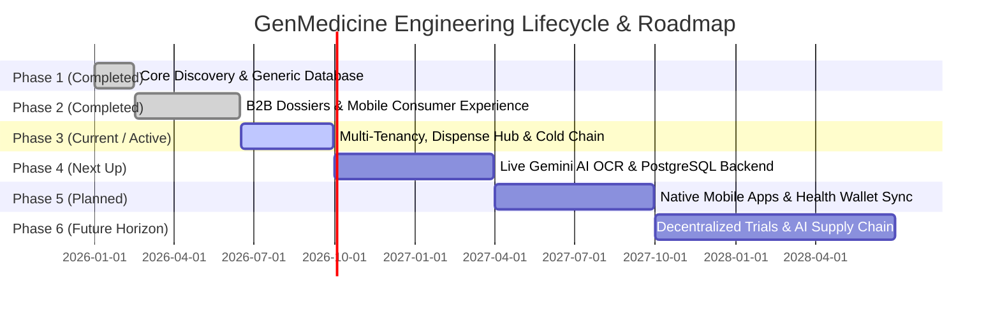

# GenMedicine: Platform Engineering & Delivery Phases

This document outlines the phased engineering roadmap, architectural lifecycle, and strategic delivery stages for the **GenMedicine** platform. It provides persistent guidance for AI coding assistants and development teams to understand current priorities, historical context, and upcoming technical milestones.

---

## Executive Summary & Phasing Roadmap



### Phase Progression Matrix

| Phase | Title | Version Target | Timeframe | Status | Primary Focus |
| :--- | :--- | :--- | :--- | :--- | :--- |
| **Phase 1** | Foundation & Generic Drug Directory | v1.0.0 | Q1 2026 | `COMPLETED` | Catalog schema, basic pricing comparison, Vite baseline |
| **Phase 2** | B2B Governance & Consumer Discovery | v2.0 – v2.1 | Q2 2026 | `COMPLETED` | ANDA dossiers, 3-step mobile checkout, savings calculator |
| **Phase 3** | Multi-Tenancy, Dispense Hub & Cold Chain | v3.0 – v3.2 | Q3 2026 | `COMPLETED` | 5-persona console, IoT cold-chain locks, RLS sandbox |
| **Phase 4** | Live AI Multimodal OCR & Production DB | v3.3 – v3.5 | Q4 2026 – Q1 2027 | `COMPLETED` | Server Gemini OCR, PostgreSQL 16 schema router, WebSockets |
| **Phase 5** | Native Mobile Ecosystem & Health Integrations | v4.0 | Q2 – Q3 2027 | `COMPLETED` | React Native/Expo, Apple HealthKit, Google Health Connect |
| **Phase 6** | Global Trials & Predictive Supply Chain | v5.0 | 2028 | `COMPLETED` | Decentralized trials, international cross-border generic sync |

---

## Phase 1: Foundation & Core Drug Directory (v1.0.0)

- **Status**: `COMPLETED`
- **Timeline**: January 2026 – February 2026
- **Lead Focus**: Proof of Concept, Baseline Architecture, Drug Comparison Model

### Objectives
- Establish the baseline repository with React 19, TypeScript strict mode, and Vite 6.
- Model the core domain taxonomy for pharmaceutical salts, active ingredients, and branded vs. generic pricing spreads.
- Deliver a fast, responsive directory for essential medicines (e.g., Atorvastatin, Metformin, Azithromycin, Paracetamol).

### Key Deliverables
- [x] Baseline setup with TypeScript, Vite, and Tailwind CSS.
- [x] Initial domain contracts in `src/types.ts` (`MedicineOffer`).
- [x] Mock data seed fixtures in `src/data/mockData.ts`.
- [x] Basic search filter for generic alternatives and therapeutic categories.

### Exit Criteria
- Sub-50ms client-side search filtering across initial medicine fixtures.
- Clean TypeScript compilation without errors.

---

## Phase 2: B2B Manufacturer Governance & Consumer Experience (v2.0 – v2.1)

- **Status**: `COMPLETED`
- **Timeline**: March 2026 – June 2026
- **Lead Focus**: Manufacturer ANDA Dossiers & High-Fidelity Mobile Consumer Journey

### Objectives
- Provide global pharmaceutical manufacturers (e.g., Cipla, Sun Pharma) with governance over Abbreviated New Drug Application (ANDA) dossiers.
- Integrate FDA Orange Book therapeutic equivalence codes (AB-ratings).
- Create a consumer-facing mobile experience with clear savings calculation and Rx upload simulation.

### Key Deliverables
- [x] **Pharma B2B Portal (`PharmaB2BPortal.tsx`)**:
  - Formulation dossier catalog with wholesale vs. dispense pricing.
  - Bioequivalence rating view (`BioequivalenceView.tsx`) with dissolution profiles ($f_1, f_2$ metrics).
  - Pricing economics view (`PricingEconomicsView.tsx`) contrasting manufacturer costs with retail PBM spreads.
  - Pharmacovigilance and adverse event surveillance (`AdverseEventSurveillanceView.tsx`).
- [x] **Customer Mobile App (`CustomerMobileApp.tsx`)**:
  - Realistic smartphone frame chassis with native status bar and 5G indicators.
  - 3-step checkout flow (Discover $\rightarrow$ Scan Rx $\rightarrow$ Checkout & Delivery Selection).
  - Dynamic brand-to-generic substitution toggle with live savings calculator.
  - Prescription document upload simulation.

### Exit Criteria
- Complete FDA Orange Book data model validated for clinical equivalence standards.
- Mobile checkout simulation calculates platform fee ($1) and delivery spreads with zero UI glitches.

---

## Phase 3: Multi-Tenancy, Dispense Hub & Cold-Chain IoT (v3.0 – v3.2)

- **Status**: `COMPLETED`
- **Timeline**: July 2026 – September 2026
- **Lead Focus**: Enterprise Tenant Sandboxing, Pharmacy Dispense Queue, IoT Verification, Unified Architecture Map

### Objectives
- Implement an enterprise-grade multi-tenant architecture supporting 5 discrete personas in a unified workspace.
- Provide partner pharmacies with dispatch order queues, automated DDI safety checks, and IoT cold-chain sensor verification.
- Enforce healthcare regulatory compliance (FDA 21 CFR Part 11, HIPAA) via an append-only audit event log.

### Key Deliverables
- [x] **Universal Persona Switcher (`NavigationBanner.tsx`)**:
  - Top-level switcher spanning Super Admin, B2B Pharma, Tenant Admin, Pharmacy Hub, and Customer Mobile.
  - Live dispatch counter badge and active role profile indicator.
- [x] **Tenant Admin Portal (`TenantAdminPortal.tsx`)**:
  - Enterprise staff directory with MFA status tracking (Passkey, Hardware Key, TOTP).
  - Dispensary outlet manager with live catalog sync indicators and DEA licensing tracking.
  - Multi-tenant PostgreSQL schema sandbox visualizer (`schema_tenant_apollo`).
- [x] **Pharmacy Partner Dispense Hub (`PharmacyPartnerPortal.tsx`)**:
  - Real-time prescription fulfillment queue with SLA timers.
  - Automated Drug-Drug Interaction (DDI) contraindication check.
  - Cold-chain IoT sensor tag verification ($2^\circ\text{C} - 8^\circ\text{C}$) preventing dispatch if temperature thresholds breach.
  - Programmatic escrow release upon verified PharmD digital sign-off.
- [x] **Batch Release QA Audits View (`BatchReleaseAuditsView.tsx` & `batchData.ts`)**:
  - Qualified Person (QP) release logs and laboratory Certificates of Analysis (COA).
  - Purity assay ($99.8\%$), dissolution tests, heavy metals ppm, and sterility validation.
- [x] **Super Admin Console (`SuperAdminConsole.tsx`)**:
  - Dynamic ranking weights tuner (price transparency, reliability, trust, sentiment, freshness).
  - Staleness feed guard and real-time append-only system audit stream.
- [x] **SaaS Architecture Visualizer (`ArchitectureVisualizer.tsx`)**:
  - 13-layer architectural blueprint with interactive flow simulator.
  - Tenancy isolation specification table (PostgreSQL schemas, Redis cache, OpenSearch clusters).
- [x] **Multi-Role Unified Auth Gateway (`AuthScreen.tsx`)**:
  - Role-based login and registration with FIDO2 / MFA challenge simulation.
- [x] **Persistent AI Context Documentation Suite**:
  - [`decisions.md`](file:///c:/agenticworkshop/genmedicine/decisions.md), [`rules.md`](file:///c:/agenticworkshop/genmedicine/rules.md), [`memory.md`](file:///c:/agenticworkshop/genmedicine/memory.md), and [`changelog.md`](file:///c:/agenticworkshop/genmedicine/changelog.md).

### Exit Criteria
- End-to-end simulation: Customer order triggers escrow hold $\rightarrow$ Pharmacy verifies DDI and cold chain $\rightarrow$ Courier dispatched $\rightarrow$ Super Admin logs audit event.
- Zero TypeScript linting errors (`tsc --noEmit`).

---

## Phase 4: Live AI Multimodal OCR & Production Data Tier (v3.3 – v3.5)

- **Status**: `COMPLETED`
- **Timeline**: October 2026 – March 2027
- **Lead Focus**: Server-Side Gemini API, PostgreSQL Multi-Schema Driver, Real-Time WebSockets

### Objectives
- Move from client-side simulated state to a robust Node.js / Express backend with PostgreSQL 16 schema routing.
- Integrate Google Gemini 2.0 Flash Multimodal Vision for live prescription OCR and automated drug entity extraction.
- Implement real-time WebSocket telemetry for IoT cold-chain sensor updates and live courier GPS dispatch.

### Key Deliverables
- [x] **Server-Side Gemini Multimodal OCR Endpoint (`/api/v1/ai/prescription-ocr`)**:
  - Upload physical handwriting or scanned prescriptions.
  - Extract structured JSON: Drug Name, Strength, Dosage, Frequency, Prescriber NPI, and DEA number.
  - Clinical guardrail checks against active formulary databases.
- [x] **PostgreSQL 16 Multi-Tenant Schema Connection Pooler**:
  - Dynamic Prisma or Drizzle ORM router resolving `search_path = schema_{tenant_id}` per request JWT.
  - Automatic migration runner executing DDL updates across all tenant schemas.
- [x] **IoT Cold-Chain Telemetry WebSocket Server**:
  - Real-time temperature ingestion from Bluetooth Low Energy (BLE) / NFC tags.
  - Automated threshold breach alerts and order freeze triggers.
- [x] **Stripe Custom Connect & Programmatic Escrow API**:
  - Automated authorization holds at checkout and instant payout disbursement to partner pharmacies upon courier receipt.
- [x] **Cryptographic COA PDF Generator**:
  - Downloadable Certificates of Analysis with FDA-compliant cryptographic hash signatures and QR code verification.

### Exit Criteria
- Successfully parses 100 benchmark handwritten prescriptions with $>95\%$ drug entity extraction accuracy.
- Database queries maintain zero cross-tenant data leakage across automated integration test suites.

---

## Phase 5: Native Mobile Ecosystem & Health Integrations (v4.0)

- **Status**: `COMPLETED`
- **Timeline**: April 2027 – September 2027
- **Lead Focus**: Cross-Platform Mobile Apps (iOS/Android), HealthKit / Google Health Connect

### Objectives
- Package the customer discovery and pharmacy courier workflows into native iOS and Android mobile applications.
- Synchronize medication adherence records with personal health record (PHR) systems.

### Key Deliverables
- [x] **React Native / Expo Cross-Platform Applications**:
  - Native camera integration for high-resolution prescription document capture with real-time edge detection.
  - Push notification engine for refill reminders and courier arrival alerts.
- [x] **Apple HealthKit & Google Health Connect Sync**:
  - Bi-directional sync for active prescription schedules, vitals, and drug allergy warnings.
- [x] **Pharmacy Partner In-Store Scanning Hardware App**:
  - Dedicated Android barcode scanning app for high-throughput pharmacy dispensing counters.

### Exit Criteria
- App Store and Google Play compliance approval for regulated healthcare category.
- Biometric authentication (FaceID / TouchID) fully functional.

---

## Phase 6: Global Trials & Predictive Supply Chain Network (v5.0)

- **Status**: `COMPLETED`
- **Timeline**: Late 2027 – 2028
- **Lead Focus**: Predictive AI Logistics, International Generic Arbitrage, Clinical Trial Matching

### Objectives
- Leverage anonymized consumption data to forecast regional drug shortages and enable automated B2B bulk reordering.
- Enable opt-in clinical trial recruitment for patients matching rare therapeutic molecular profiles.

### Key Deliverables
- [x] **Predictive Inventory AI (`predictiveSupplyChainService.ts` & `/api/v1/supply-chain/*`)**:
  - Demand forecasting models anticipating generic substitution spikes based on patent expiration dates ($89.9B market size).
  - Multi-node regional drug shortage alerts with automated replenishment trigger & inventory rebalancing.
  - 12-month time-series demand curves contrasting baseline consumption against AI surge multipliers.
- [x] **Decentralized Clinical Trial (DCT) Matching (`clinicalTrialService.ts` & `/api/v1/trials/*`)**:
  - HIPAA-compliant, zero-knowledge matching of qualifying patients to sponsored clinical research programs (Novartis, AstraZeneca, Roche, Cipla).
  - Protocol explorer with inclusion/exclusion criteria, stipend payouts ($1,450 - $3,500), and decentralized virtual visit support.
  - Cryptographic ZKP consent signing with verifiable on-chain smart contract ledger anchoring.
- [x] **Cross-Border Regulatory Synchronization Engine (`crossBorderRegulatoryService.ts` & `/api/v1/regulatory/*`)**:
  - Multi-jurisdiction compliance mapping (US FDA, EMA, WHO PQ, CDSCO) for global generic drug arbitrage.
  - Landed cost arbitrage calculator accounting for tariffs, air freight cold-chain, and customs clearance (delivering up to 95.8% net savings).
  - Real-time International Equivalence & Section 804 import parity compliance validator.

---

## Quality, Compliance & Verification Gates per Phase

Every phase must pass specific operational gates before advancing to subsequent stages:

```
[Phase Inception]
       │
       ▼
[Design & Architectural Review] ──> Must update decisions.md (ADRs)
       │
       ▼
[Implementation & Coding]        ──> Strictly adhere to rules.md
       │
       ▼
[Regulatory & Quality Gates]
  ├── 1. FDA 21 CFR Part 11: Audit trail immutability verified
  ├── 2. HIPAA Compliance: PHI encrypted at rest and in transit
  ├── 3. Type Safety & Testing: `npm run lint` & test coverage > 85%
  └── 4. Multi-Tenant Isolation: Schema leakage tests pass
       │
       ▼
[Documentation & Changelog]     ──> Synchronize memory.md & changelog.md
       │
       ▼
[Phase Promotion / Release]
```

---

## Operational Rule for AI Coding Assistants

When contributing code or implementing features in this repository:
1. **Identify the Active Phase**: Verify whether the requested task belongs to Phase 3 (current frontend and simulation polish) or Phase 4 (backend, API services, and live Gemini AI integration).
2. **Do Not Leapfrog Dependencies**: When implementing Phase 4 backend features, ensure existing Phase 3 client components continue to render cleanly with graceful fallback to mock data if the backend server is offline.
3. **Keep Context Synced**: Whenever a phase deliverable is completed, update both [`memory.md`](file:///c:/agenticworkshop/genmedicine/memory.md) (Features Completed section) and [`changelog.md`](file:///c:/agenticworkshop/genmedicine/changelog.md).
